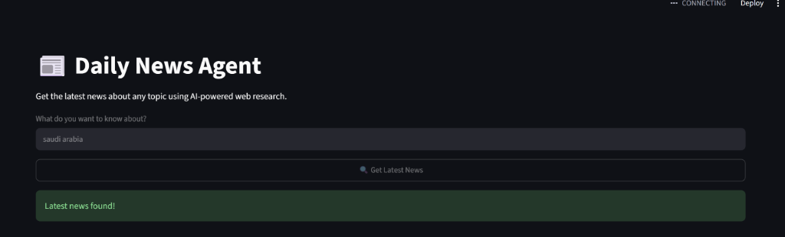
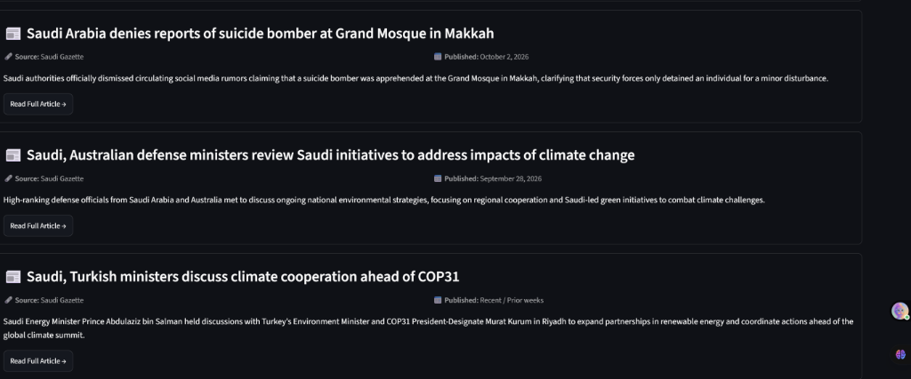

# 📰 Daily News Agent

An AI-powered web research agent that automatically finds, analyzes, and summarizes the latest news on any topic using **CrewAI**, **Google Gemini LLM**, **Serper Web Search**, and a **Streamlit** user interface.

---

## 📸 Output & Screenshots

### 1. Web Application Search Interface
Searching for real-time news topics (e.g. *Saudi Arabia*):



### 2. Generated News Summaries & Source Cards
Structured AI-curated news cards complete with source name, publication date, short summary, and direct article link:



---

## ✨ Features

- 🔎 **Real-time Web Search**: Uses SerperDevTool to query current news from across the web.
- 🤖 **AI-Powered Summarization**: Powered by CrewAI and Google Gemini LLM to extract key details.
- 📰 **Structured News Cards**: Displays headlines, sources, publication dates, concise summaries, and article URLs.
- 🎨 **Modern Streamlit Interface**: Clean, responsive layout for seamless user interaction.

---

## 📁 Project Structure

```text
DailyNewsAgent/
├── assets/
│   ├── app_search.png   # Screenshot of search input interface
│   └── app_results.png  # Screenshot of output news cards
├── app.py               # Streamlit Web UI application
├── news_agents.py       # CrewAI agent, search tool, and task workflow definition
├── test_backend.py      # CLI script to test backend logic independently
├── requirements.txt     # Python package dependencies
├── .env.example         # Environment variable template
├── .gitignore           # Git ignore rules (protects API keys)
└── README.md            # Project documentation
```

---

## 🚀 Quick Start

### 1. Clone the Repository

```bash
git clone https://github.com/dhanshreeg03/Dailynewsagent.git
cd Dailynewsagent
```

### 2. Install Dependencies

Ensure Python 3.10+ is installed, then install the packages from `requirements.txt`:

```bash
pip install -r requirements.txt
```

### 3. Configure Environment Variables

Create a `.env` file in the root directory (refer to `.env.example`):

```env
SERPER_API_KEY=your_serper_api_key_here
GEMINI_API_KEY=your_gemini_api_key_here
```

### 4. Run the Application

Start the Streamlit web server:

```bash
streamlit run app.py
```

Or test via CLI:

```bash
python test_backend.py
```

---

## 🛠️ Built With

- **[Streamlit](https://streamlit.io/)** - Web UI Framework
- **[CrewAI](https://www.crewai.com/)** - Multi-Agent AI Framework
- **[Google Gemini](https://deepmind.google/technologies/gemini/)** - Large Language Model
- **[Serper.dev](https://serper.dev/)** - Google Search API

---

## 👤 Author

- **dhanshreeg03** - [GitHub Profile](https://github.com/dhanshreeg03)
