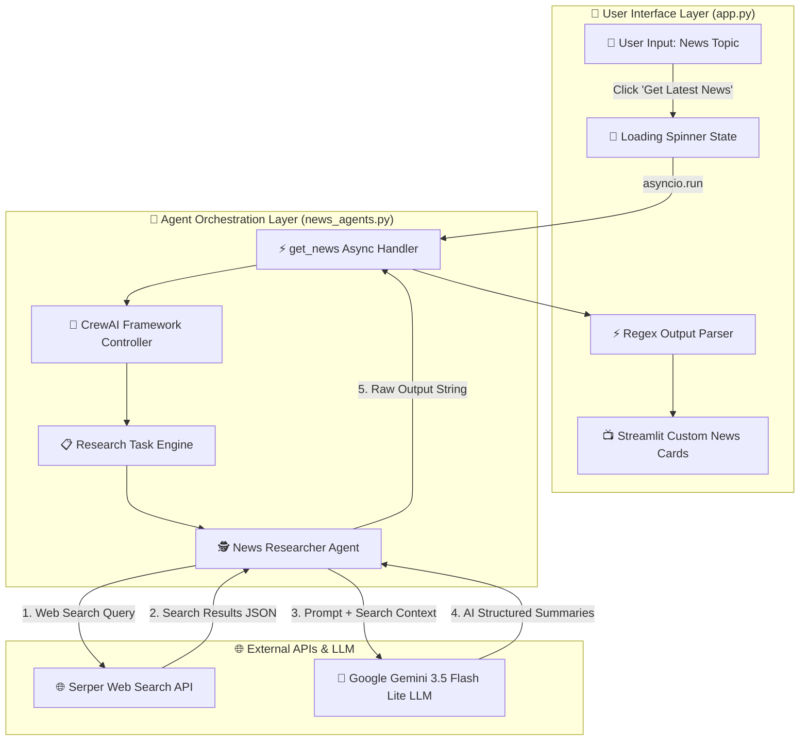
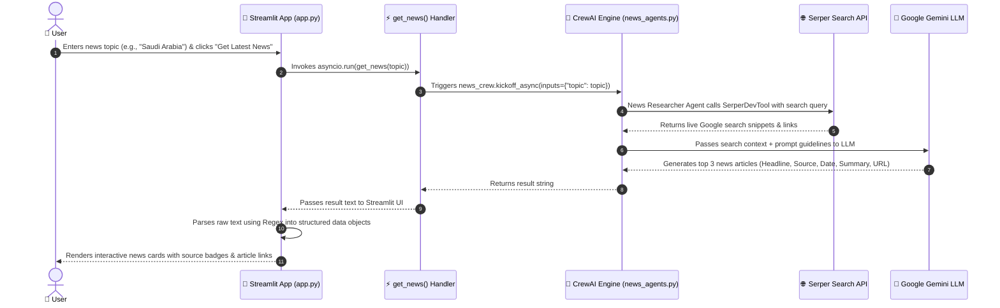

# 📊 Daily News Agent - Workflow & Architecture Specification

This document provides a detailed breakdown of the internal workflow, data transformations, and component interactions within the **Daily News Agent** application.

---

## 🏗️ High-Level System Architecture

---

## ⏱️ End-to-End Sequence Diagram

---

## 🔄 Detailed Step-by-Step Data Flow

| Step | Component | Action | Description |
| :--- | :--- | :--- | :--- |
| **1** | **Streamlit UI** (`app.py`) | User Input | Captures the search topic entered by the user. |
| **2** | **Async Event Loop** | Trigger Execution | Runs `asyncio.run(get_news(topic))` to trigger non-blocking backend execution. |
| **3** | **CrewAI Engine** (`news_agents.py`) | Task Kickoff | Passes topic input to `news_crew.kickoff_async()` containing the `News Researcher` agent. |
| **4** | **SerperDevTool** | Web Retrieval | Queries Google Search API for recent articles from the past few days. |
| **5** | **Google Gemini LLM** | Context Processing | Evaluates search snippets, selects 3 key articles, extracts metadata (Headline, Source, Date, Summary, URL). |
| **6** | **Regex Parser** (`app.py`) | Data Structuring | Uses Regular Expressions (`re.split` & `re.search`) to isolate individual article fields. |
| **7** | **Streamlit Container** | UI Rendering | Displays styled news cards with source badges, publication dates, and `Read Full Article →` links. |

---

## 👤 Author

- **dhanshreeg03** - [GitHub Repository](https://github.com/dhanshreeg03/Dailynewsagent)
